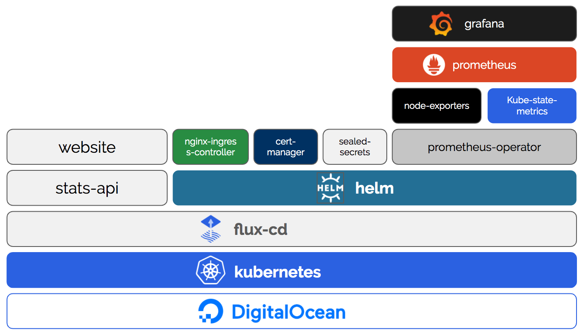

# k8s-config-repo 
"GitOps" repo for Cloud Native Nordics k8s environment. This repo controls the applications running in the kubernetes environment available to the Cloud Native Nordics community. 

## Kubernetes-based Infrastructure for a Static Site
Yes, this is indeed what this is at the moment. However, the greater purpose of setting this infrastructure up is to use it as a reference stack for members of the Cloud Native Nordics community.

## The stack
This setup can be used as a getting started guide for using [Cloud Native Computing Foundation (CNCF)](https://www.cncf.io) projects. 

At the moment this stack contains the following official CNCF hosted projects: 

* [Kubernetes](https://github.com/kubernetes/kubernetes)
* [Prometheus](https://github.com/prometheus/prometheus)
* [Helm](https://github.com/helm/helm)
* [Flux](https://github.com/fluxcd/flux)

If further utilizes the following open source projects:

* [NGINX Ingress Controller](https://github.com/kubernetes/ingress-nginx)
* [cert-manager](https://github.com/kubernetes/ingress-nginx)
* [sealed-secrets](https://github.com/bitnami-labs/sealed-secrets)
* [grafana](https://github.com/grafana/grafana)

An overview of the stack is visualized below:

## GitOps

To demonstrate the different options of using flux as a GitOps operator, we both support raw kubernetes yaml files and the custom resources `HelmRelease` provided by flux. 

* `releases` contains the `HelmRelease` crds for the different projects we are utilizing
* `workloads` contains raw kubernetes yaml for our own services

